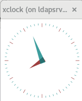

instalar Xorg y que ssh haga forward al X
===========================================

Por lo normal en los servidores no queremos tener instalado una suite completa de Desktop como lo es Gnome o KDE. Pero en algunas ocasiones hay aplicaciones que requieren el protocolo de las X, como lo pudiera ser algunos productos Oracle, productos de IBM, etc. Para estos casos solo instalamos el xorg-server y xorg-x11-xauth para el ssh.

Instalando los paquetes necesarios
+++++++++++++++++++++++++++++++++++

Instalando xorg-x11-server-Xorg.x86_64.::

	# yum -y install xorg-x11-server-Xorg.x86_64

Instalando xorg-x11-xauth.::

	# yum install xorg-x11-xauth

Archivos de configuración
+++++++++++++++++++++++++++++

En el server debe tener estas lineas /etc/ssh/sshd_config::

	X11Forwarding yes
	X11DisplayOffset 10
	X11UseLocalhost no

En el cliente debe tener estas lineas ~/.ssh/config ::

	Host *
	  ForwardAgent yes
	  ForwardX11 yes

Test ssh forward a las X
+++++++++++++++++++++++++

Nos conectamos al servidor con ssh y le pasamos el parámetro ".X" y debemos consultar la variable DISPLAY y el ssh debe fijarle el valor automaticamente.::
 
	$ ssh -X root@192.168.1.21
	root@192.168.1.21's password: 
	Last login: Wed Oct  3 19:42:07 2018 from 192.168.1.4
	/usr/bin/xauth:  file /root/.Xauthority does not exist
	# echo $DISPLAY
	localhost:10.0

Instalar unas aplicaciones X
+++++++++++++++++++++++++++++++

Siempre es bueno tener alguna aplicación en X para hacer un test. Como siempre olvido cual es el paquete que la tiene xclock, pues.::

	# yum provides '*/xclock'
	Complementos cargados:fastestmirror
	Loading mirror speeds from cached hostfile
	 * base: mirror.uta.edu.ec
	 * extras: mirror.uta.edu.ec
	 * updates: mirror.uta.edu.ec
	base/7/x86_64/filelists_db	| 6.9 MB  00:00:29     
	extras/7/x86_64/filelists_db	| 603 kB  00:00:02     
	updates/7/x86_64/filelists_db	| 3.2 MB  00:00:15     
	xorg-x11-apps-7.7-7.el7.x86_64 : X.Org X11 applications
	Repositorio        : base
	Resultado obtenido desde:
	Nombre del archivo    : /usr/bin/xclock

Instalamos el paquete que descubrimos que tiene xclock.::

	# yum install xorg-x11-apps-7.7-7.el7.x86_64

Ahora desde el servidor ejecutamos el xclock y debemos ver este aplicativo en nuestras X.::

	# xclock

Esto es lo que debemos ver.

